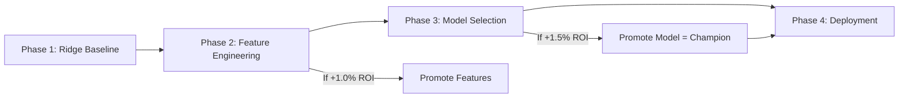

# V2 Baseline Model (Ridge Regression)

**Status**: Phase 1 — Baseline Establishment  
**Model**: Ridge Regression (sklearn)  
**Features**: Minimal Unadjusted EPA/SR  
**Philosophy**: Start simple, validate V2 workflow  
**Date Established**: TBD (2025-12-XX)

---

## Overview

The **V2 Baseline** is the foundation of the new experimentation workflow. It is intentionally simple, fast, and reproducible, serving as the benchmark against which all future improvements are measured.

> **Note**: This represents a complete reset from legacy models (CatBoost/XGBoost v5). Legacy models are archived; V2 starts from scratch with rigor-first philosophy.

---

## Objective

1. **Establish Benchmark**: Create a simple, interpretable baseline model
2. **Validate Workflow**: Prove the V2 4-phase workflow (Baseline → Features → Models → Deployment)
3. **Define Floor**: Set minimum acceptable performance before adding complexity

---

## Model Architecture

### Algorithm

**Ridge Regression** (`sklearn.linear_model.Ridge`)

**Rationale**:

- **Interpretable**: Linear coefficients are explainable
- **Fast**: Trains in seconds, no hyperparameter tuning needed
- **Stable**: Regularization prevents overfitting
- **Baseline-appropriate**: Simple enough to measure feature/model improvements clearly

**Hyperparameters**:

- `alpha=1.0` (L2 regularization strength, fixed for baseline)

---

## Features

### Phase 1: Minimal Unadjusted Set

**Philosophy**: Start from **raw, unadjusted** statistics to establish absolute floor performance.

**Feature Set**: `minimal_unadjusted_v1`

**Features** (4 total):

```python
home_off_epa_pp       # Home team offensive EPA per play (season-to-date)
home_def_epa_pp       # Home team defensive EPA per play (season-to-date)
away_off_epa_pp       # Away team offensive EPA per play (season-to-date)
away_def_epa_pp       # Away team defensive EPA per play (season-to-date)
```

**Data Source**: `processed/team_season/year=YYYY/team=XXX/side=offense|defense/*.csv`

**Rationale**:

- EPA (Expected Points Added) is the most predictive single metric in CFB
- Season-to-date aggregation is simple and transparent
- No opponent adjustment — this establishes the baseline before proving adjustment helps
- No recency weighting — uniform weighting of all games
- No special teams, tempo, or advanced features — added in Phase 2 if they improve performance

---

## Targets

**Spread Prediction** (Primary):

```python
spread_target = home_final_points - away_final_points
```

**Total Prediction** (Optional):

```python
total_target = home_final_points + away_final_points
```

---

## Training Protocol

### Data Split

| Year(s)         | Purpose        | Usage                                        |
| --------------- | -------------- | -------------------------------------------- |
| 2019, 2021-2023 | Training       | Fit Ridge regression                         |
| 2024            | Test (Holdout) | Evaluate performance, never used in training |
| 2025            | Deployment     | Live predictions                             |

**Critical Rule**: **Never** include 2024 data in training. This is the locked holdout for all V2 experiments.

**COVID Exclusion**: 2020 excluded due to season disruptions (shortened schedule, opt-outs).

---

### Training Steps

1. **Load Data**:

   ```bash
   uv run python src/features/v1_pipeline.py \
       --years 2019,2021,2022,2023,2024
   ```

2. **Train Model**:

   ```bash
   PYTHONPATH=. uv run python src/train.py \
       model=linear \
       features=minimal_unadjusted_v1 \
       training.train_years=[2019,2021,2022,2023] \
       training.test_year=2024
   ```

3. **Log to MLflow**:
   - Experiment: `v2_baseline`
   - Run name: `ridge_minimal_v1`
   - Metrics: `rmse`, `mae`, `hit_rate`, `roi`

---

## Expected Performance

### Hypothesis

**RMSE**: 12-14 points (spread prediction error)  
**Hit Rate**: 51-53% (against closing line, ATS)  
**ROI**: -2% to +2% (near breakeven with -110 odds)

**Rationale**:

- Unadjusted EPA is moderately predictive but known to be biased by schedule strength
- Linear model cannot capture non-linear interactions
- This sets a realistic floor for Phase 2/3 improvements

### Promotion Criteria for Phase 2

To graduate to Phase 2 (Feature Engineering & Selection):

- [ ] Baseline documented in MLflow with full metrics
- [ ] Performance within expected range (not anomalous)
- [ ] Reproducible (can re-run and get same results ±1%)

---

## Storage & Artifacts

**Model Artifacts**:

```
artifacts/models/baseline/v2-001/
├── model.joblib           # Trained Ridge model
├── metadata.json          # Training config, metrics
└── feature_importance.csv # Feature coefficients
```

**MLflow Tracking**:

```
Experiment: v2_baseline
├── Run: ridge_minimal_v1
│   ├── params/
│   │   ├── model.alpha: 1.0
│   │   ├── features: minimal_unadjusted_v1
│   │   └── training.test_year: 2024
│   ├── metrics/
│   │   ├── spread_rmse: X.XX
│   │   ├── spread_mae: X.XX
│   │   ├── spread_hit_rate: 0.XXX
│   │   └── spread_roi: 0.XXX
│   └── artifacts/
│       └── ridge_spread.joblib
```

---

## Path to V2 Champion

This baseline is **not** intended to be the final production model. It is the starting point of a rigorous journey:



**Timeline**:

- **Week 1-2**: Establish this baseline
- **Week 3-6**: Phase 2 — Test opponent adjustment, recency weighting
- **Week 7-10**: Phase 3 — Test CatBoost, XGBoost on best features
- **Week 11-12**: Phase 4 — Deploy Champion Model

**Success = Beating this baseline through rigorous, gated promotion**

---

## Configuration

### Hydra Config

**Model**: `conf/model/linear.yaml`

```yaml
name: linear
type: linear_regression
params:
  alpha: 1.0
target: spread_target
```

**Features**: `conf/features/minimal_unadjusted_v1.yaml`

```yaml
name: minimal_unadjusted_v1
description: "Phase 1 baseline - raw EPA/SR only"
features:
  - home_off_epa_pp
  - home_def_epa_pp
  - away_off_epa_pp
  - away_def_epa_pp
```

**Training**: `conf/training/default.yaml`

```yaml
train_years: [2019, 2021, 2022, 2023]
test_year: 2024
deploy_year: 2025
```

---

## Comparison to Legacy Models

| Metric          | V2 Ridge Baseline       | Legacy CatBoost v5               |
| --------------- | ----------------------- | -------------------------------- |
| Algorithm       | Ridge Regression        | CatBoost Gradient Boosting       |
| Features        | 4 (minimal, unadjusted) | ~40 (adjusted, engineered)       |
| Training Time   | <1 minute               | ~15 minutes                      |
| Hyperparameters | 1 (alpha)               | ~10 (depth, iterations, etc.)    |
| Hit Rate (2024) | TBD                     | 50.1% (spread), 51.4% (total)    |
| ROI (2024)      | TBD                     | -0.36% (spread), +11.95% (total) |
| Status          | ✅ V2 Baseline          | 🗄️ Archived                      |

**Goal**: Match or exceed legacy performance through systematic improvement, not initial complexity.

---

## Decision Log Entries

Related decisions:

- [2025-12-05: V2 Workflow Adoption](../decisions/decision_log.md#2025-12-05-v2-workflow-adoption) (pending)
- [2025-12-05: Unadjusted Baseline Philosophy](../decisions/decision_log.md#2025-12-05-unadjusted-baseline-philosophy) (pending)
- [2025-12-05: Pure V2 Rebuild](../decisions/decision_log.md#2025-12-05-pure-v2-rebuild) (pending)

---

## Next Steps

1. **Immediate** (Week 1):

   - [ ] Generate processed data for 2019, 2021-2024
   - [ ] Create `conf/features/minimal_unadjusted_v1.yaml`
   - [ ] Train Ridge baseline and log to MLflow
   - [ ] Document metrics in decision log

2. **Phase 2** (Week 3-6):

   - [ ] Test `opponent_adjusted_v1` feature set
   - [ ] Test `recency_weighted_v1` feature set
   - [ ] Run 5-gate promotion tests
   - [ ] Promote winning feature set (if any pass)

3. **Phase 3** (Week 7-10):
   - [ ] Test CatBoost on promoted features
   - [ ] Test XGBoost on promoted features
   - [ ] Promote Champion Model (if passes +1.5% ROI gate)

---

**Last Updated**: 2025-12-05  
**Owner**: V2 Workflow Implementation Team
