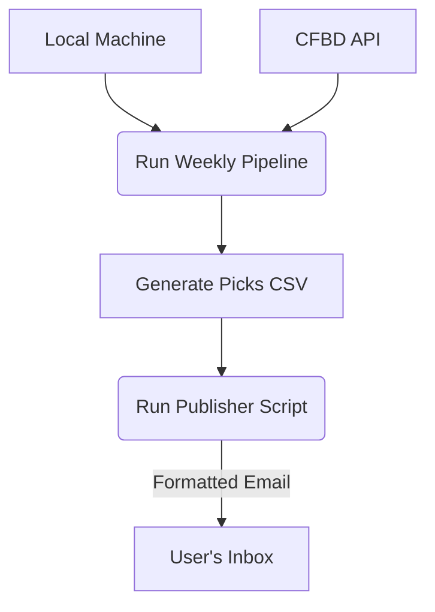
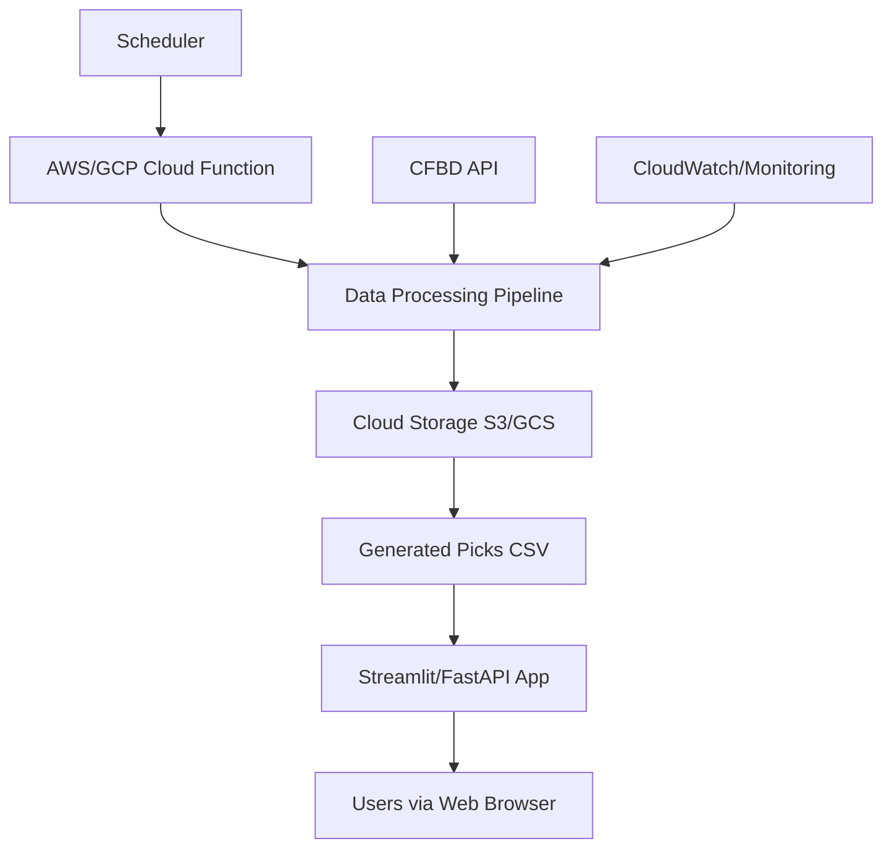
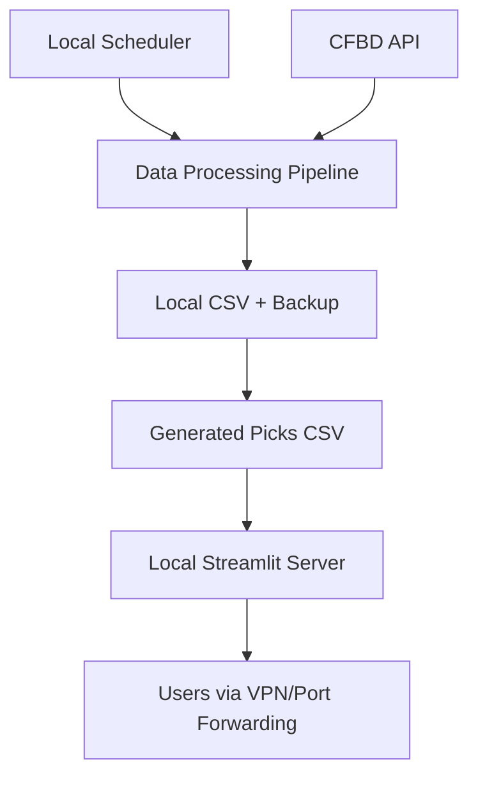

# Production Deployment Strategy

This document outlines the production deployment options for the cfb_model system, covering hosting, monitoring, backup, and security considerations.

> 🔗 **Related**: [Open Decision OPEN-001](../project_org/open_decisions.md#open-001-production-deployment-strategy) | [Weekly Pipeline](weekly_pipeline.md)

---

## Deployment Architecture Options

### Option A: Publisher Model (Local Execution + Email) - ✅ RECOMMENDED

This model addresses the constraint of data living on a local external hard drive by avoiding the need for a constantly accessible web server. The pipeline runs locally and pushes the results to the user.

**Architecture**:

**Components**:
- **Data Processing**: Local machine with external drive storage, executed via `scripts/cli.py`.
- **Output**: Standard `_bets.csv` report.
- **Publishing**: A new script (`scripts/publish_picks.py`) formats the CSV into a clean HTML table and emails it to a configured address.

**Pros**:
- ✅ **Maximum Security**: No inbound network connections are required. Your local machine is never exposed to the internet.
- ✅ **High Reliability**: Once the report is emailed, it's accessible from any device (phone, laptop) without depending on the local machine being online.
- ✅ **Simplicity & Low Cost**: Very easy to implement and maintain using standard Python libraries. No hosting costs.
- ✅ **Data Privacy**: All data and models remain on your local machine. Only the final report is sent.

**Cons**:
- ❌ **Not Interactive**: The output is a static report. There are no live dashboards or controls.
- ❌ **Requires Email Configuration**: User must configure SMTP credentials (e.g., a Gmail App Password) in a local `.env` file.

**Estimated Setup Time**: <1 day
**Monthly Cost**: $0

### Option B: Full Cloud Migration

**Architecture**:

**Components**:
- **Data Processing**: AWS Lambda/Google Cloud Functions
- **Storage**: S3/Google Cloud Storage
- **Web Interface**: Streamlit on cloud or custom FastAPI

**Pros**:
- ✅ Fully automated pipeline, high reliability, and built-in monitoring.

**Cons**:
- ❌ High complexity, significant hosting costs ($50-200/month), and vendor lock-in.

### Option C: Semi-Automated Local Server

**Architecture**:

**Components**:
- **Data Processing**: Local machine with `cron`.
- **Web Interface**: Local Streamlit server.
- **Access**: Port forwarding or VPN.

**Pros**:
- ✅ Automated pipeline execution with lower costs than full cloud.

**Cons**:
- ❌ **Security Risk**: Port forwarding is a significant security concern.
- ❌ **High Maintenance**: Depends on home network stability and requires manual network configuration.

---

## Decision & Recommendation

Given the core constraint that data resides on a local external hard drive, **Option A: Publisher Model** is the clear and recommended path forward. It is the most secure, reliable, and simple solution that perfectly fits the project's operational reality.

The original recommendation of a hybrid Streamlit Cloud app is no longer viable due to the inability of the cloud service to reliably access the local data source.