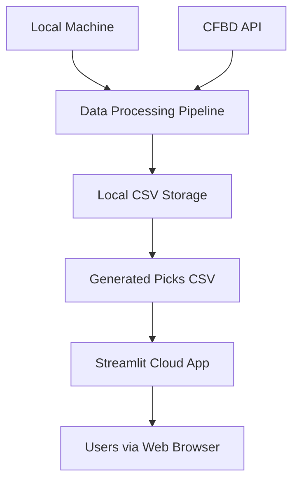
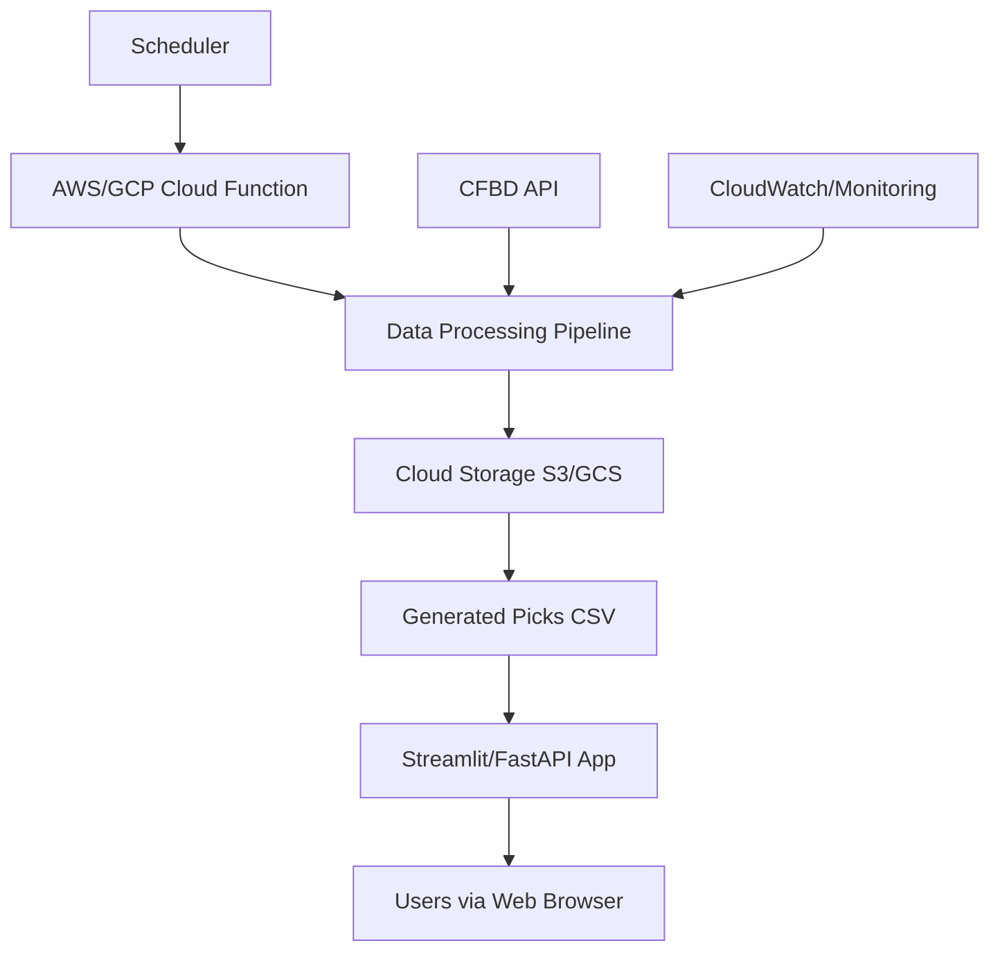
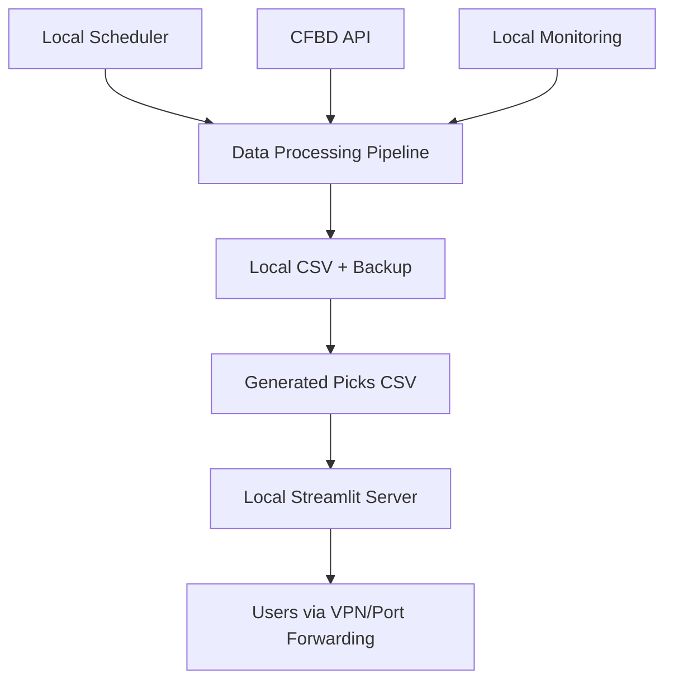

# Production Deployment Strategy

This document outlines the production deployment options for the cfb_model system, covering hosting, monitoring, backup, and security considerations.

> 🔗 **Related**: [Open Decision OPEN-001](../project_org/open_decisions.md#open-001-production-deployment-strategy) | [Weekly Pipeline](weekly_pipeline.md)

---

## Deployment Architecture Options

### Option A: Local + Streamlit Cloud (Hybrid) - **RECOMMENDED**

**Architecture**:


**Components**:
- **Data Processing**: Local machine with external drive storage
- **Web Interface**: Streamlit Community Cloud deployment  
- **Data Sync**: Manual CSV upload to cloud storage (Google Drive/Dropbox)
- **Authentication**: Streamlit secrets + simple password

**Pros**:
- ✅ Minimal hosting costs (Streamlit Community Cloud is free)
- ✅ Data stays local (privacy/control)
- ✅ Simple deployment and maintenance
- ✅ Quick to implement (2-3 days)
- ✅ Can handle manual weekly pipeline perfectly

**Cons**:
- ❌ Manual data sync required
- ❌ Single point of failure (your local machine)
- ❌ Limited scalability
- ❌ No automated monitoring

**Estimated Setup Time**: 3-5 days  
**Monthly Cost**: $0-$20 (cloud storage only)

### Option B: Full Cloud Migration

**Architecture**:


**Components**:
- **Data Processing**: AWS Lambda/Google Cloud Functions
- **Storage**: S3/Google Cloud Storage with lifecycle management
- **Web Interface**: Streamlit on cloud or custom FastAPI
- **Scheduling**: CloudWatch Events/Cloud Scheduler
- **Monitoring**: CloudWatch/Google Cloud Monitoring

**Pros**:
- ✅ Fully automated pipeline
- ✅ High reliability and uptime
- ✅ Built-in monitoring and alerting
- ✅ Scales automatically
- ✅ Professional backup/disaster recovery

**Cons**:
- ❌ High complexity and learning curve
- ❌ Significant hosting costs ($50-200/month)
- ❌ Longer development time (2-3 weeks)
- ❌ Vendor lock-in risks

**Estimated Setup Time**: 10-15 days  
**Monthly Cost**: $50-$200

### Option C: Semi-Automated Local

**Architecture**:


**Components**:
- **Data Processing**: Local machine with cron/scheduled tasks
- **Storage**: Local with automated backup to cloud
- **Web Interface**: Local Streamlit server
- **Access**: Port forwarding or VPN
- **Monitoring**: Simple email alerts

**Pros**:
- ✅ Automated pipeline execution
- ✅ Lower costs than full cloud
- ✅ More control than hybrid option
- ✅ Better monitoring than Option A

**Cons**:
- ❌ Home network dependency  
- ❌ Security concerns (port forwarding)
- ❌ Limited external access
- ❌ Still single point of failure

**Estimated Setup Time**: 5-8 days  
**Monthly Cost**: $10-$30

---

## Detailed Implementation Plans

### Implementation Plan A: Local + Streamlit Cloud (RECOMMENDED)

#### Phase 1: Local Pipeline Setup (2 days)
1. **Environment Setup**
   ```bash
   # Create production environment
   uv venv --name cfb-prod
   source cfb-prod/bin/activate
   uv sync --extra dev
   
   # Configure production data root
   echo "CFB_MODEL_DATA_ROOT=/Volumes/ExternalDrive/cfb_data" >> .env.prod
   ```

2. **Weekly Pipeline Script**
   ```bash
   # Create unified weekly script
   scripts/run_weekly_pipeline.py
   ```

3. **Output Validation**
   - Ensure CSV output matches Streamlit app expectations
   - Add data quality checks and error handling

#### Phase 2: Cloud Storage Integration (1 day)
1. **Google Drive/Dropbox Setup**
   ```python
   # Add cloud sync functionality
   from google.oauth2.credentials import Credentials
   from googleapiclient.discovery import build
   
   def upload_weekly_picks(csv_path, week):
       # Upload to shared Google Drive folder
   ```

2. **Automated Upload**
   - Script to upload weekly picks after generation
   - Backup previous week's results

#### Phase 3: Streamlit Cloud Deployment (2 days)
1. **Streamlit App Structure**
   ```
   streamlit_app/
   ├── app.py                 # Main Streamlit application
   ├── pages/
   │   ├── current_picks.py   # Current week recommendations  
   │   ├── performance.py     # Historical performance
   │   └── about.py          # Model explanation
   ├── utils/
   │   ├── data_loader.py    # Load picks from cloud storage
   │   └── auth.py          # Simple password authentication
   ├── requirements.txt      # Dependencies
   └── .streamlit/
       └── secrets.toml      # Authentication secrets
   ```

2. **Authentication Setup**
   ```toml
   # .streamlit/secrets.toml
   [passwords]
   app_password = "your-secure-password"
   
   [gcp]
   service_account = "..."  # For Google Drive access
   ```

3. **Streamlit Cloud Configuration**
   - Connect to GitHub repository
   - Configure secrets in Streamlit dashboard
   - Set up custom domain (optional)

#### Phase 4: Monitoring & Alerts (1 day)
1. **Basic Monitoring**
   ```python
   # Add to weekly pipeline
   def send_completion_email(status, picks_count):
       # Send email notification of pipeline completion
   ```

2. **Health Checks**
   - Verify data freshness in Streamlit app
   - Alert if picks haven't been updated

### Security Configuration

#### Authentication Options

**Option 1: Simple Password (MVP)**
```python
import streamlit as st

def authenticate():
    password = st.text_input("Password", type="password")
    if password == st.secrets["passwords"]["app_password"]:
        st.session_state["authenticated"] = True
        return True
    return False
```

**Option 2: Google OAuth (Future)**
```python
from streamlit_oauth import st_oauth

def authenticate_google():
    if st_oauth(
        client_id=st.secrets["google"]["client_id"],
        client_secret=st.secrets["google"]["client_secret"],
        redirect_uri="...",
        scope="email profile"
    ):
        st.session_state["authenticated"] = True
        return True
```

#### Data Security
- **Encryption at Rest**: Cloud storage with encryption enabled
- **HTTPS**: Streamlit Cloud provides SSL/TLS automatically  
- **Access Control**: Password protection + optional IP restrictions
- **Data Retention**: Keep historical picks for analysis, purge old logs

---

## Monitoring Strategy

### Application Monitoring

#### Key Metrics
| Metric | Threshold | Alert Method | Frequency |
|:-------|:----------|:-------------|:----------|
| **Data Freshness** | >7 days old | Email | Daily |
| **Pipeline Success** | Failed run | Email | Immediate |
| **Picks Generated** | <10 games | Email | Weekly |
| **App Uptime** | <95% | Streamlit status | Daily |
| **Model Accuracy** | <50% win rate | Email | Weekly |

#### Monitoring Implementation
```python
# monitoring/checks.py
def check_data_freshness():
    """Check if picks CSV is recent"""
    latest_file = get_latest_picks_file()
    age_hours = (datetime.now() - latest_file.modified_time).hours
    
    if age_hours > 168:  # 7 days
        send_alert("Data staleness detected", f"Latest picks are {age_hours} hours old")

def check_model_performance():
    """Monitor recent model accuracy"""
    recent_results = load_recent_results(weeks=4)
    win_rate = calculate_win_rate(recent_results)
    
    if win_rate < 0.50:
        send_alert("Model performance degraded", f"Win rate: {win_rate:.1%}")
```

### Business Metrics Dashboard

```python
# streamlit_app/pages/performance.py
def show_performance_metrics():
    st.header("Model Performance")
    
    col1, col2, col3, col4 = st.columns(4)
    
    with col1:
        st.metric("Win Rate", "54.2%", "+1.8%")
    with col2:
        st.metric("ROI", "8.4%", "+2.1%")
    with col3:
        st.metric("Units Won", "+12.3", "+4.2")
    with col4:
        st.metric("Bets This Week", "8", "-2")
    
    # Historical performance chart
    chart_data = load_performance_history()
    st.line_chart(chart_data)
```

---

## Backup & Disaster Recovery

### Data Backup Strategy

#### Local Backups
```bash
# Daily backup script
#!/bin/bash
DATE=$(date +%Y%m%d)
BACKUP_DIR="/Volumes/BackupDrive/cfb_backups/$DATE"

# Create backup directory
mkdir -p "$BACKUP_DIR"

# Backup data
rsync -av /Volumes/ExternalDrive/cfb_data/ "$BACKUP_DIR/data/"
rsync -av ./models/ "$BACKUP_DIR/models/"
rsync -av ./reports/ "$BACKUP_DIR/reports/"

# Compress backup
tar -czf "$BACKUP_DIR.tar.gz" "$BACKUP_DIR"
rm -rf "$BACKUP_DIR"
```

#### Cloud Backups
```python
# cloud_backup.py
def backup_to_cloud():
    """Weekly backup to cloud storage"""
    # Backup essential data
    files_to_backup = [
        "data/processed/",
        "models/",
        "reports/",
        "session_logs/"
    ]
    
    for file_path in files_to_backup:
        upload_to_gcs(file_path, f"backups/{datetime.now().isoformat()}/{file_path}")
```

#### Recovery Procedures

**Scenario 1: Local Data Corruption**
1. Stop pipeline processes
2. Restore from most recent backup
3. Verify data integrity with manifest checks
4. Resume operations

**Scenario 2: Complete Local System Failure**
1. Provision new machine/environment
2. Install dependencies (uv, Python 3.12+)
3. Restore code from GitHub
4. Restore data from cloud backup
5. Reconfigure environment variables
6. Test pipeline end-to-end before resuming

**Recovery Time Objectives (RTO)**:
- Local data issues: < 4 hours
- System replacement: < 24 hours
- Service degradation: < 1 hour

### Business Continuity

#### Failover Plans
- **Primary**: Local pipeline + Streamlit Cloud
- **Backup Option 1**: Manual CSV generation + Google Sheets
- **Backup Option 2**: Historical model predictions from previous week

#### Emergency Procedures
```markdown
## Emergency Response Checklist

### If Pipeline Fails on Wednesday
1. [ ] Check CFBD API status
2. [ ] Run manual data collection
3. [ ] Generate picks with backup model
4. [ ] Post emergency notification to users
5. [ ] Document incident for review

### If Model Performance Degrades
1. [ ] Revert to previous week's model  
2. [ ] Run diagnostic on recent data
3. [ ] Consider reducing bet recommendations
4. [ ] Notify users of conservative approach

### If External Dependencies Fail
1. [ ] Switch to backup data sources
2. [ ] Use cached/historical data if needed
3. [ ] Reduce prediction confidence
4. [ ] Document workarounds applied
```

---

## Cost Analysis

### Option A: Local + Streamlit Cloud
| Component | Monthly Cost | Annual Cost |
|:----------|:------------:|:-----------:|
| Streamlit Community Cloud | $0 | $0 |
| Google Drive (2TB) | $10 | $120 |
| Domain (optional) | $1 | $12 |
| **Total** | **$11** | **$132** |

### Option B: Full Cloud
| Component | Monthly Cost | Annual Cost |
|:----------|:------------:|:-----------:|
| AWS Lambda (compute) | $20 | $240 |
| S3 Storage | $5 | $60 |
| CloudWatch Monitoring | $10 | $120 |
| EC2/App Runner (web app) | $25 | $300 |
| **Total** | **$60** | **$720** |

### Option C: Semi-Automated Local  
| Component | Monthly Cost | Annual Cost |
|:----------|:------------:|:-----------:|
| Dynamic DNS service | $5 | $60 |
| VPN service | $5 | $60 |
| Cloud backup storage | $3 | $36 |
| **Total** | **$13** | **$156** |

---

## Decision Framework

### Evaluation Criteria

| Criteria | Weight | Option A | Option B | Option C |
|:---------|:------:|:--------:|:--------:|:--------:|
| **Cost** | 20% | 9/10 | 4/10 | 8/10 |
| **Reliability** | 25% | 6/10 | 9/10 | 7/10 |
| **Ease of Setup** | 20% | 9/10 | 3/10 | 6/10 |
| **Maintainability** | 15% | 8/10 | 5/10 | 7/10 |
| **Security** | 10% | 7/10 | 9/10 | 6/10 |
| **Scalability** | 10% | 4/10 | 10/10 | 5/10 |

**Weighted Scores**:
- **Option A (Local + Cloud)**: 7.4/10 ✅ **RECOMMENDED**
- **Option B (Full Cloud)**: 6.4/10
- **Option C (Semi-Automated)**: 6.9/10

### Recommendation: Option A

**Rationale**:
1. **Perfect fit for MVP**: Simple, cost-effective, quick to deploy
2. **Matches current workflow**: Manual weekly pipeline works well
3. **Low risk**: Easy to change later if needs evolve
4. **Proven technology**: Streamlit Cloud is reliable and well-supported

**Next Steps**:
1. Set target decision date: **January 17, 2025**
2. Create proof-of-concept Streamlit app (2 days)
3. Test cloud storage integration (1 day)
4. Document final implementation plan

---

*Last Updated: 2025-01-03*  
*Decision Target: 2025-01-17*  
*Next Review: Weekly Wednesday sprint planning*
