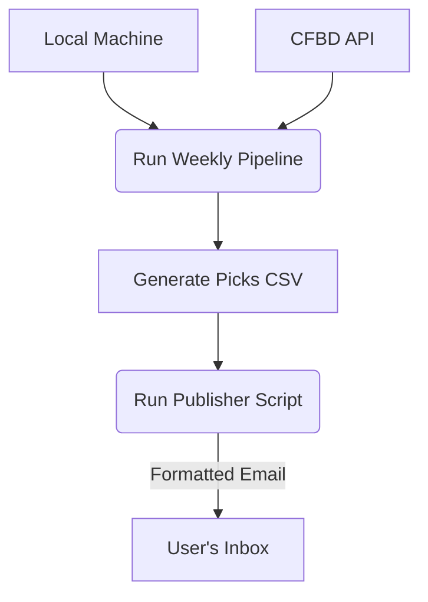
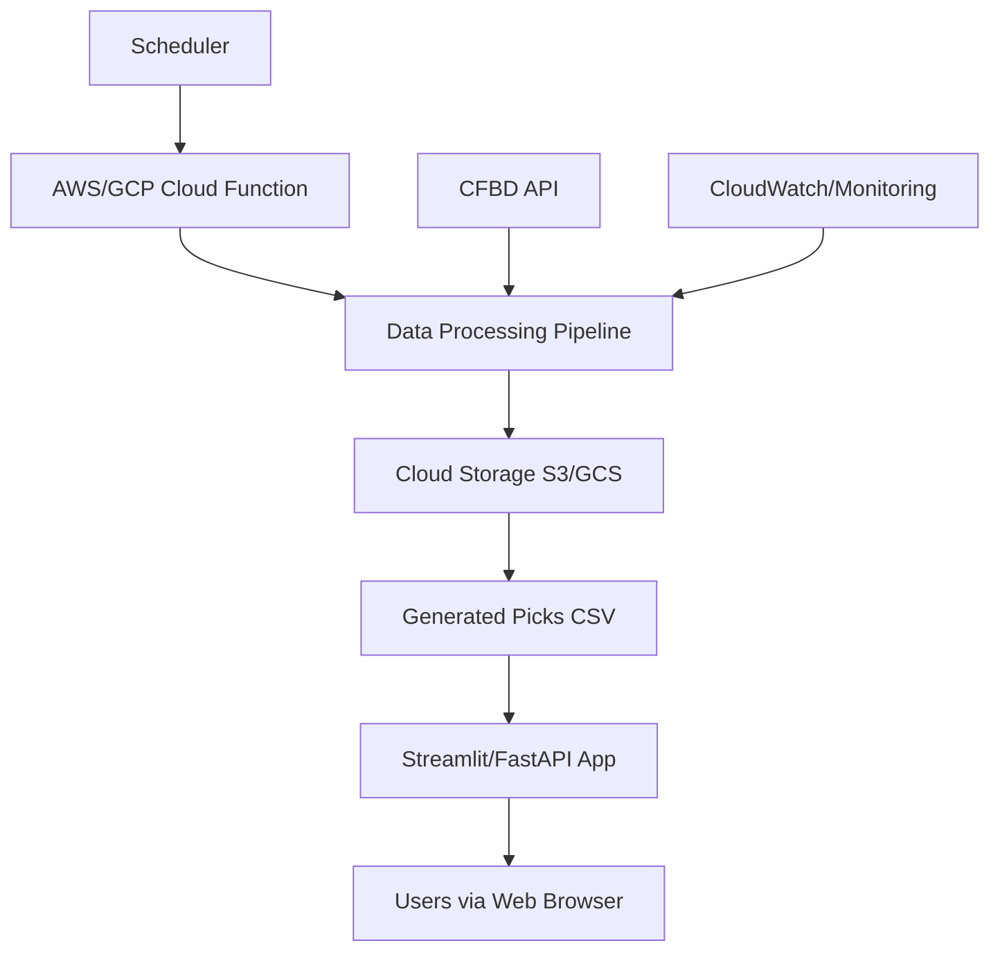
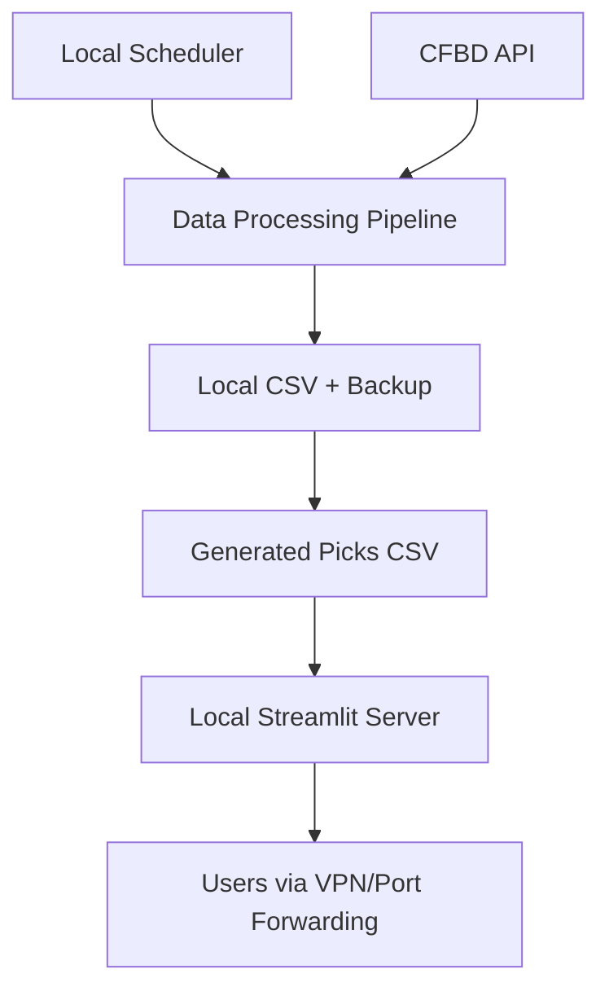

# Production Deployment Strategy

**Status**: V2-aligned as of 2025-12-05

This document outlines the production deployment options for the cfb_model system, covering hosting, monitoring, backup, and security considerations.

> 🔗 **Related**: [V2 Workflow](../process/experimentation_workflow.md) | [Weekly Pipeline](weekly_pipeline.md) | [Promotion Framework](../process/promotion_framework.md)

---

## V2 Phase 4: Deployment Criteria

**NEW as of Dec 2025**: A model can ONLY be deployed to production after passing all Phase 4 requirements.

### Prerequisites for Production Deployment

A candidate model must have successfully completed **all 3 prior phases**:

1. **Phase 1 Complete**: Ridge baseline established and documented
2. **Phase 2 Complete**: Features promoted (passed 5-gate system with +1.0% ROI)
3. **Phase 3 Complete**: Model promoted (passed 5-gate system with +1.5% ROI)

### Champion Model Requirements

The "Champion Model" is selected in Phase 3 and must meet these criteria before Phase 4 deployment:

✅ **5-Gate Checklist** (from Phase 3):

1. **Performance**: +1.5% ROI improvement over Ridge baseline (95% confidence)
2. **Volume**: ≥100 bets in test set
3. **Statistical Significance**: Bootstrap p-value < 0.05 (10,000 iterations)
4. **Stability**: Positive ROI in 3/4 quarterly splits (walk-forward)
5. **No Degradation**: No metric regression (hit rate, calibration, volume)

✅ **MLflow Registration**:

- Model artifact saved to MLflow
- Tagged with `phase: 3`, `promoted: true`, `production: true`
- Experiment ID and metrics logged

✅ **Documentation**:

- Decision log entry explaining Champion selection
- Feature registry updated with promoted features
- Experiment index updated (V2-006 or final Phase 3 experiment)

### Manual Deployment Process

**V2 uses a manual workflow** (no automation):

1. **User verifies** all 5 gates passed
2. **User reviews** model artifacts in MLflow
3. **User creates** `conf/model/champion.yaml` config
4. **User updates** decision log
5. **User begins** using Champion for weekly predictions (see [Weekly Pipeline](./weekly_pipeline.md))

**Monitoring** is via Streamlit dashboard (manual review, not automated alerts)

---

## Deployment Architecture Options

### Option A: Publisher Model (Local Execution + Email) - ✅ RECOMMENDED

This model addresses the constraint of data living on a local external hard drive by avoiding the need for a constantly accessible web server. The pipeline runs locally and pushes the results to the user.

**Architecture**:

**Components**:

- **Data Processing**: Local machine with external drive storage, executed via `scripts/cli.py`.
- **Output**: Standard `_bets.csv` report.
- **Publishing**: A new script (`scripts/publish_picks.py`) formats the CSV into a clean HTML table and emails it to a configured address.

**Pros**:

- ✅ **Maximum Security**: No inbound network connections are required. Your local machine is never exposed to the internet.
- ✅ **High Reliability**: Once the report is emailed, it's accessible from any device (phone, laptop) without depending on the local machine being online.
- ✅ **Simplicity & Low Cost**: Very easy to implement and maintain using standard Python libraries. No hosting costs.
- ✅ **Data Privacy**: All data and models remain on your local machine. Only the final report is sent.

**Cons**:

- ❌ **Not Interactive**: The output is a static report. There are no live dashboards or controls.
- ❌ **Requires Email Configuration**: User must configure SMTP credentials (e.g., a Gmail App Password) in a local `.env` file.

**Estimated Setup Time**: <1 day
**Monthly Cost**: $0

### Option B: Full Cloud Migration

**Architecture**:

**Components**:

- **Data Processing**: AWS Lambda/Google Cloud Functions
- **Storage**: S3/Google Cloud Storage
- **Web Interface**: Streamlit on cloud or custom FastAPI

**Pros**:

- ✅ Fully automated pipeline, high reliability, and built-in monitoring.

**Cons**:

- ❌ High complexity, significant hosting costs ($50-200/month), and vendor lock-in.

### Option C: Semi-Automated Local Server

**Architecture**:

**Components**:

- **Data Processing**: Local machine with `cron`.
- **Web Interface**: Local Streamlit server.
- **Access**: Port forwarding or VPN.

**Pros**:

- ✅ Automated pipeline execution with lower costs than full cloud.

**Cons**:

- ❌ **Security Risk**: Port forwarding is a significant security concern.
- ❌ **High Maintenance**: Depends on home network stability and requires manual network configuration.

---

## Decision & Recommendation

Given the core constraint that data resides on a local external hard drive, **Option A: Publisher Model** is the clear and recommended path forward. It is the most secure, reliable, and simple solution that perfectly fits the project's operational reality.

The original recommendation of a hybrid Streamlit Cloud app is no longer viable due to the inability of the cloud service to reliably access the local data source.
