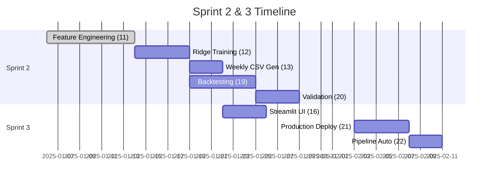

# Implementation Schedule

This document is the tactical plan for the **cfb_model** project. It translates the goals from the
[Project Charter](../project_org/project_charter.md) into a high-level schedule of epics and tasks.

> 📋 **Last Updated**: 2025-01-13 | **Next Review**: Weekly Wednesday sprint planning
> 🔗 **Related**: [Open Decisions](../project_org/open_decisions.md) | [Decision Log](../decisions/decision_log.md)

## Sprint Overview

**Current Sprint:** Sprint 2 (Core Implementation)  
**Sprint Duration:** 3 weeks  
**Target Completion:** Week 4 of CFB season (mid-September 2025)

**Sprint Goal:** Implement core feature engineering pipeline, Ridge baseline model training, and
weekly prediction generation. Establish MVP betting recommendation system with basic evaluation.

**Key Dependencies**:  
- Decision OPEN-001 (Production Deployment) needed before live operation  
- 2014 data backfill for complete training dataset (can proceed without)

### Task Board (Sprint 1)

| ID | Epic          | Deliverable                                      | Owner | Status |
|:--:|:--------------|:--------------------------------------------------|:-----:|:------:|
| 1  | Docs          | Rename `reference/` → `project_org/`, fix links   | @dev  | ✅ Done |
| 2  | Docs          | Add `modeling_baseline.md`, `weekly_pipeline.md`  | @dev  | ✅ Done |
| 3  | Docs          | Add `decisions/README.md`, `decision_log.md`      | @dev  | ✅ Done |
| 4  | Docs          | Update `mkdocs.yml` + `docs/index.md` nav         | @dev  | ✅ Done |
| 5  | CFBD Data     | Update ingestion: FBS-only, 2015–2024 (incl. 2020)| @dev  | ✅ Done |
| 6  | Operations    | Weekly pipeline (Wed 12 ET) + CSV spec            | @dev  | ✅ Done |
| 7  | Planning      | Refresh roadmap + acceptance criteria              | @dev  | ✅ Done |
| 8  | Feature Eng.  | Plan opponent-adj features (iter. avg, last-3)    | @dev  | ✅ Done |
| 9  | Modeling      | Outline training (season silo; Ridge)             | @dev  | ✅ Done |
| 10 | Operations    | Document bet thresholds and constraints            | @dev  | ✅ Done |

### Acceptance Criteria (Sprint 1)

- Project docs reorganized under `docs/project_org/`; nav updated in `mkdocs.yml` and `docs/index.md`.
- `docs/project_org/modeling_baseline.md` defines MVP model + betting policy.
- `docs/operations/weekly_pipeline.md` defines schedule, steps, and CSV output schema.
- CFBD resources moved to `docs/cfbd/resources/`.
- `docs/cfbd/data_ingestion.md` reflects FBS-only scope and clarifies ingestion coverage (2015–2024
  complete today) vs. modeling training window (2014–2024, excluding 2020). 2014 backfill is tracked
  as a backlog item.
- `docs/project_org/feature_catalog.md` expanded with:
  - Play filters (CFBD success rate thresholds; scrimmage-only), explosive definitions (rush ≥10,
    pass ≥15; overall 10+/20+/30+ buckets), possession metrics (Eckel rate; finishing points per opp).
  - Opponent-adjustment algorithm: additive offset, 4 iterations, linear last-3 game weights (3/2/1).
  - Validation ranges and reproducibility requirements.
- MVP feature artifacts specification documented: `features/<year>/*` (CSV; team-season,
  team-week, team-game), `features/<year>/manifest.json`, and a seasonal summary CSV at
  `reports/metrics/features_<year>_summary.csv`.
- Markdownlint: MD029 fixed in weekly pipeline; no critical new warnings introduced.

### Sprint 2 Tasks (Core Implementation) - Current

| ID | Epic | Deliverable | Effort | Dependencies | Owner | Status |
|:--:|:-----|:-----------|:------:|:-------------|:-----:|:------:|
| 11 | Feature Eng. | Implement iterative averaging (4 iters) + feature catalog | 8d | Task 5 ✅ | @dev | ✅ Complete |
| 12 | Modeling | Ridge training + weekly prediction scripts | 5d | Task 11 | @dev | 📋 Ready |
| 13 | Operations | Generate weekly CSV at `reports/YYYY/CFB_weekWW_bets.csv` | 3d | Task 12 | @dev | 📋 Ready |
| 19 | Testing | Historical backtesting framework (2019-2024) | 6d | Task 12 | @dev | 📋 Ready |

**Sprint 2 Risks**:  
- ✅ **Opponent adjustment complexity**: ~~May take longer than estimated (8d → 12d)~~ RESOLVED - Task 11 completed on schedule  
- ⚠️ **Data quality issues**: Historical data inconsistencies could delay validation  
- 🔍 **Mitigation**: Start with simpler averaging, expand iteratively

### Sprint 3 Tasks (Production Readiness) - Planned

| ID | Epic | Deliverable | Effort | Dependencies | Owner | Status |
|:--:|:-----|:-----------|:------:|:-------------|:-----:|:------:|
| 16 | Web Interface | Minimal Streamlit view of weekly CSV | 4d | Task 13, OPEN-003 | @dev | 🚫 Blocked |
| 21 | Production | Production deployment setup | 5d | OPEN-001 | @dev | 🚫 Blocked |
| 22 | Operations | Weekly pipeline automation | 3d | Task 21 | @dev | 🚫 Blocked |
| 20 | Validation | Model evaluation metrics and validation reports | 4d | Task 19 | @dev | 📋 Ready |
| 15 | Explainability | SHAP summaries for model insights | 4d | Task 12 | @dev | 📋 Ready |
| 17 | Performance | ROI/win rate tracking dashboards | 3d | Task 16 | @dev | 📋 Ready |

**Sprint 3 Risks**:  
- 🚫 **Deployment decision**: Blocked on OPEN-001, affects all production tasks  
- ⚠️ **Streamlit complexity**: Authentication may add complexity  

### Backlog (Future Sprints)

| ID | Epic | Deliverable | Effort | Dependencies | Priority |
|:--:|:-----|:-----------|:------:|:-------------|:--------:|
| 14 | Modeling | Try alternative models (XGBoost, RF) after MVP | 6d | Task 20, OPEN-002 | Medium |
| 18 | CFBD Data | Backfill 2014 season across entities | 3d | None | Low |
| 23 | Advanced Features | Weather/injury data integration | 8d | OPEN-006 | Low |
| 24 | Risk Management | Kelly criterion unit sizing | 4d | Task 20, OPEN-005 | Medium |
| 25 | Monitoring | Performance monitoring & alerting | 5d | Task 21, OPEN-007 | Low |

## Execution Checklist

- CFBD exploration
  - Document endpoints, params, rate limits, and common fields; add sample pulls script/notebook
  - Acceptance: endpoints/payloads documented; sample script prints schema examples

- External storage setup
  - Use `--data-root` (e.g., `/Volumes/EXTDRV/cfb_model_data`) and validate write permissions
  - Acceptance: ingestion writes CSV to external drive; path documented

- Data transformation → modeling-ready
  - Build season-to-date aggregates; opponent adjustments (4 iterations) with last-3 weighting
  - Acceptance: reproducible feature build; feature catalog page added

- Modeling and testing (historical)
  - Train per-season Ridge for spread/total; report RMSE/MAE vs baselines; persist artifacts
  - Acceptance: metrics table produced per season; artifacts saved

- Backtesting vs historical lines
  - Compute edges; apply bet policy; track ROI/hit rate weekly and cumulatively
  - Acceptance: `reports/backtests/*` CSVs generated with summary KPIs

- Weekly live pipeline (current season)
  - Manual run (Wed 12:00 ET) producing `reports/YYYY/CFB_weekWW_bets.csv` per runbook
  - Acceptance: one entry-point runs E2E; clear success summary

---

## Effort Estimation Framework

### Estimation Guidelines
- **1d**: Simple configuration, documentation updates, minor bug fixes
- **2-3d**: Single feature implementation, basic testing, straightforward integration
- **4-6d**: Complex feature with edge cases, comprehensive testing, multiple integrations
- **8d+**: Major architectural changes, research-heavy work, end-to-end system changes

### Capacity Planning
- **Available Capacity**: 20 days per sprint (4 weeks × 5 days/week)
- **Sprint 2 Load**: 22 days estimated → **110% capacity** ⚠️ Slightly over-allocated
- **Action Taken**: Moved Task 20 (Validation) to Sprint 3 for better balance

### Task Dependencies Visualization

---

## Risk Management

### Current Sprint Risks
| Risk | Prob. | Impact | Days at Risk | Mitigation | Owner |
|:-----|:-----:|:------:|:------------:|:-----------|:-----:|
| **Opponent adjustment complexity** | High | High | +4d | Implement simple averaging first, iterate | @dev |
| **Historical data quality issues** | Medium | High | +2d | Validate data early, build quality checks | @dev |
| **Sprint overallocation** | High | Medium | -6d | Move validation to Sprint 3, reduce scope | @dev |

### Strategic Risks  
| Risk | Prob. | Impact | Mitigation | Review Date |
|:-----|:-----:|:------:|:-----------|:-----------:|
| CFBD API unreliability | Medium | High | Error handling, caching, monitoring | Weekly |
| Win rate below 52.4% | Medium | High | Improve features and tuning | After 4 weeks |
| Overly complex feature pipeline | Low | Medium | Start simple; add complexity gradually | Monthly |
| **NEW**: Production deployment decision delay | High | High | Set decision deadline, evaluate all options | 2025-01-17 |
| **NEW**: Model performance worse than expected | Medium | High | Prepare alternative models, feature expansion | After backtesting |

### Risk Response Plans
- **Weekly Risk Review**: Every Wednesday during sprint planning
- **Risk Escalation**: If any risk becomes "High/High", escalate immediately
- **Contingency Planning**: Maintain 20% buffer in sprint planning for risk mitigation

---

## Sprint Retrospective

*To be filled out at the end of each sprint.*

| What Went Well | What Didn't Go Well | Action Items for Next Sprint |
|:---------------|:--------------------|:-----------------------------|
| TBD            | TBD                 | TBD                          |
