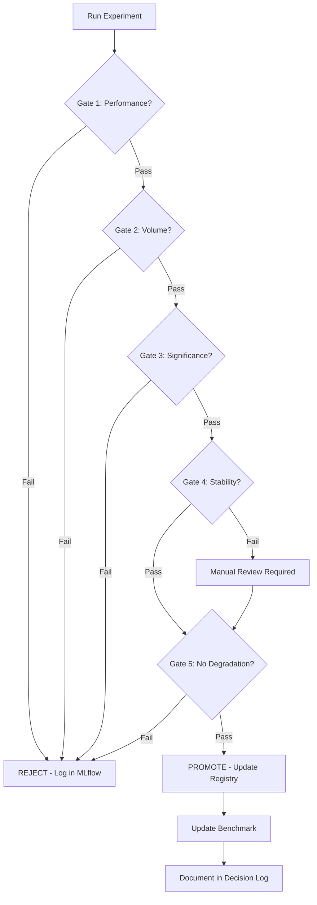

# Promotion Framework — V2 Workflow

**Status**: Active  
**Version**: 1.0  
**Date**: 2025-12-05

---

## Overview

The **Promotion Framework** defines the rigorous criteria that all features and models must pass before being adopted into the V2 workflow. This prevents false positives, overfitting to the holdout set, and premature complexity.

**Philosophy**: Only promote when improvement is **real, repeatable, and meaningful**.

---

## 5-Gate System

Every candidate (feature set or model) must pass **ALL gates** to be promoted:

### Gate 1: Performance Threshold

**Requirement**: Minimum improvement over current benchmark

**Phase 2 (Features)**:

- ROI lift: ≥ +1.0% absolute (e.g., 5.0% → 6.0%)
- OR Hit Rate lift: ≥ +1.5% absolute (e.g., 52.0% → 53.5%)

**Phase 3 (Models)**:

- ROI lift: ≥ +1.5% absolute (higher bar than features)
- OR Hit Rate lift: ≥ +2.0% absolute

**Rationale**: 1.0% ROI ≈ 0.5% hit rate at -110 odds. This is meaningful but achievable.

---

### Gate 2: Volume Threshold

**Requirement**: Sufficient sample size for confidence

**Threshold**:

- Holdout year (2024): ≥ 100 bets flagged by model
- If <100 bets: **REJECT** (insufficient evidence)

**Rationale**:

- 100 bets gives ~±10% margin of error at 95% confidence
- Prevents overfitting to rare edge cases
- Forces features to be broadly applicable

---

### Gate 3: Statistical Significance

**Requirement**: Improvement is not due to chance

**Test**: Bootstrap Resampling (1000 iterations)

**Method**:

1. Resample bets with replacement from 2024 holdout
2. Calculate ROI for baseline vs candidate
3. Repeat 1000 times
4. Count: P(candidate > baseline)

**Threshold**:

- Phase 2: P(improvement) > 0.90 (90% confidence)
- Phase 3: P(improvement) > 0.95 (95% confidence)

**Implementation**:

```python
def test_statistical_significance(baseline_bets, candidate_bets, n_bootstrap=1000):
    """Bootstrap test for promotion."""
    baseline_roi = calculate_roi(baseline_bets)
    candidate_roi = calculate_roi(candidate_bets)

    wins = 0
    for i in range(n_bootstrap):
        b_sample = resample(baseline_bets, replace=True)
        c_sample = resample(candidate_bets, replace=True)
        if calculate_roi(c_sample) > calculate_roi(b_sample):
            wins += 1

    confidence = wins / n_bootstrap
    return {
        'roi_lift': candidate_roi - baseline_roi,
        'p_value': 1 - confidence,
        'confidence': confidence,
        'verdict': 'PASS' if confidence > 0.90 else 'FAIL'
    }
```

---

### Gate 4: Stability Check

**Requirement**: Performance is consistent across time periods

**Test**: Walk-Forward Quarterly Validation

**Method**:

1. Split 2024 holdout into 4 quarters (Q1, Q2, Q3, Q4)
2. Calculate ROI for each quarter (baseline vs candidate)
3. Count quarters where candidate > baseline

**Threshold**:

- Must win ≥ 3 of 4 quarters\*

**Rationale**:

- Ensures improvement isn't driven by one lucky month
- Tests temporal stability
- Catches seasonality issues

\*Can be overridden with strong rationale in decision log

---

### Gate 5: No Degradation Elsewhere

**Requirement**: Secondary metrics don't get worse

**Metrics Checked**:

1. **Calibration Error**: Mean absolute prediction error
2. **Volume Change**: Bets per week
3. **Max Drawdown**: Longest losing streak

**Threshold**:

- No metric degrades > 10% vs baseline
- If any metric fails: **REJECT**

**Rationale**:

- ROI can improve while predictions get worse (lucky guesses)
- Volume drop suggests overfitting (too conservative thresholds)
- Max drawdown protects against catastrophic risk

---

## Promotion Decision Matrix

| Gate | Metric         | Phase 2 Threshold | Phase 3 Threshold | Blocking?           |
| ---- | -------------- | ----------------- | ----------------- | ------------------- |
| 1    | Performance    | +1.0% ROI         | +1.5% ROI         | ✅ Yes              |
| 2    | Volume         | ≥100 bets         | ≥100 bets         | ✅ Yes              |
| 3    | Significance   | 90% confidence    | 95% confidence    | ✅ Yes              |
| 4    | Stability      | 3/4 quarters      | 3/4 quarters      | ⚠️ Override allowed |
| 5    | No Degradation | <10% worse        | <10% worse        | ✅ Yes              |

**Verdict**: Candidate must pass ALL blocking gates to be promoted.

---

## Promotion Workflow



---

## Testing Script

**Location**: `scripts/evaluation/test_feature_promotion.py`

**Usage**:

```bash
uv run python scripts/evaluation/test_feature_promotion.py \
    --baseline-run baseline_run_id \
    --candidate-run candidate_run_id \
    --phase 2
```

**Output**:

```
=== Promotion Test Results ===
Candidate: opponent_adjusted_v1
Baseline: minimal_unadjusted_v1

Gate 1 (Performance): PASS (+1.2% ROI)
Gate 2 (Volume):      PASS (142 bets)
Gate 3 (Significance): PASS (93.4% confidence)
Gate 4 (Stability):   PASS (Won Q1, Q2, Q3, Q4)
Gate 5 (No Degr):     PASS (All metrics within 10%)

VERDICT: ✅ PROMOTE
```

---

## Phase-Specific Requirements

### Phase 2: Feature Engineering

**Goal**: Find features that improve baseline model

**Process**:

1. Train **Ridge** with new feature set
2. Compare to Ridge + minimal_unadjusted_v1
3. Run 5-gate promotion tests
4. If promoted: Update feature registry, becomes new benchmark

**Example**:

```bash
# Baseline
PYTHONPATH=. uv run python src/train.py \
    model=linear features=minimal_unadjusted_v1 experiment.name=baseline

# Candidate
PYTHONPATH=. uv run python src/train.py \
    model=linear features=opponent_adjusted_v1 experiment.name=candidate

# Test promotion
uv run python scripts/evaluation/test_feature_promotion.py \
    --baseline-run <baseline_id> --candidate-run <candidate_id> --phase 2
```

---

### Phase 3: Model Selection

**Goal**: Find models that improve on best features

**Process**:

1. Train **CatBoost/XGBoost** with promoted feature set
2. Compare to Ridge + same features
3. Run 5-gate promotion tests (stricter thresholds)
4. If promoted: Becomes "Champion Model"

**Additional Requirements**:

- Training time < 30 minutes
- Interpretability penalty: Complex models need +2.0% ROI if not interpretable

**Example**:

```bash
# Baseline (Ridge with promoted features)
PYTHONPATH=. uv run python src/train.py \
    model=linear features=combined_v1 experiment.name=baseline_v2

# Candidate (CatBoost)
PYTHONPATH=. uv run python src/train.py \
    model=catboost_v1 features=combined_v1 experiment.name=catboost_candidate

# Test promotion
uv run python scripts/evaluation/test_feature_promotion.py \
    --baseline-run <baseline_id> --candidate-run <catboost_id> --phase 3
```

---

## FAQs

### Q: What if no candidates pass promotion in Phase 2?

**A**: Ridge baseline remains the benchmark. This is an acceptable outcome — it means we haven't found features worth the complexity.

### Q: Can I override Gate 4 (stability)?

**A**: Yes, with strong rationale documented in decision log. Example: "Q4 is bowl season with different dynamics; excluding it shows 3/3 wins."

### Q: What if two candidates both pass all gates?

**A**: Promote the one with higher ROI lift. If tied, choose simpler (fewer features/parameters).

### Q: How do I handle features that improve spread but hurt total?

**A**: Run separate promotion tests for each target. A feature can be promoted for spread only.

---

## Related Documentation

- [V2 Workflow](./experimentation_workflow.md) — Overall 4-phase process
- [12-Week Plan](./12_week_implementation_plan.md) — Implementation timeline
- [Feature Registry](../project_org/feature_registry.md) — Track promoted features
- [Decision Log](../decisions/decision_log.md) — Record promotion decisions

---

**Last Updated**: 2025-12-05  
**Owner**: V2 Implementation Team
