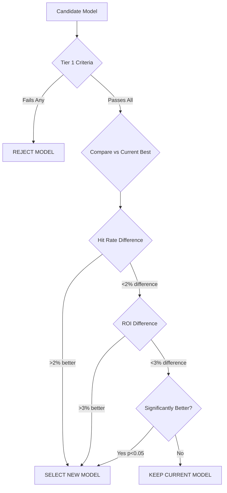

# Model Evaluation Criteria

This document defines the success thresholds, performance metrics, and model selection criteria for the cfb_model betting system.

> 🔗 **Related**: [Modeling Baseline](modeling_baseline.md) | [Open Decision OPEN-002](open_decisions.md#open-002-model-selection-post-mvp) | [Feature Catalog](feature_catalog.md)

---

## Success Thresholds

### Primary Success Metrics

#### 1. Hit Rate (Win Rate)
- **MVP Threshold**: ≥ 52.4% (break-even for -110 odds)
- **Target Performance**: ≥ 55% (strong profitability)  
- **Excellent Performance**: ≥ 58% (exceptional system)
- **Measurement Period**: Minimum 100 bets, ideally full season
- **Calculation**: `wins / total_bets`

#### 2. Return on Investment (ROI)
- **MVP Threshold**: ≥ 3% (positive expected value)
- **Target Performance**: ≥ 10% (strong profitability)
- **Excellent Performance**: ≥ 15% (exceptional returns)
- **Measurement Period**: Full season or 200+ bets
- **Calculation**: `(total_winnings - total_wagered) / total_wagered`

#### 3. Units Won
- **MVP Threshold**: ≥ +5 units per season
- **Target Performance**: ≥ +20 units per season
- **Excellent Performance**: ≥ +40 units per season
- **Measurement Period**: Full season
- **Calculation**: Sum of individual bet outcomes in units

### Secondary Success Metrics

#### 4. Prediction Accuracy (RMSE/MAE)
- **Spread Predictions**:
  - **Acceptable**: RMSE ≤ 14 points, MAE ≤ 10 points
  - **Good**: RMSE ≤ 12 points, MAE ≤ 8 points  
  - **Excellent**: RMSE ≤ 10 points, MAE ≤ 7 points
- **Total Predictions**:
  - **Acceptable**: RMSE ≤ 12 points, MAE ≤ 9 points
  - **Good**: RMSE ≤ 10 points, MAE ≤ 7 points
  - **Excellent**: RMSE ≤ 8 points, MAE ≤ 6 points

#### 5. Calibration Quality
- **Well-Calibrated**: 95% confidence intervals contain actual outcomes 90-95% of time
- **Prediction Intervals**: Should reflect true uncertainty
- **Measurement**: Reliability plots, coverage probability

#### 6. Edge Detection Ability  
- **Minimum Viable**: 60% of bets with model edge ≥ 3 points show profit
- **Target**: 70% of high-edge bets (≥ 5 points) show profit
- **Measurement**: Profit rate by edge magnitude buckets

---

## Evaluation Framework

### Model Comparison Methodology

#### 1. Historical Backtesting
```python
# Backtesting framework
def evaluate_model_historical(model, years, validation_method='walk_forward'):
    \"\"\"
    Evaluate model on historical data using walk-forward validation
    
    Args:
        model: Trained model object
        years: List of years to evaluate (e.g., [2019, 2021, 2022, 2023])
        validation_method: 'walk_forward', 'time_series_split', or 'holdout'
    
    Returns:
        dict: Comprehensive evaluation metrics
    \"\"\"
    results = {
        'hit_rate': [],
        'roi': [],
        'units_won': [],
        'rmse_spread': [],
        'mae_spread': [],
        'calibration_score': [],
        'edge_accuracy': []
    }
    
    for year in years:
        # Load training data (all previous years)
        train_data = load_training_data(years_before=year)
        
        # Load test data (current year)  
        test_data = load_test_data(year=year)
        
        # Train model on historical data
        model.fit(train_data.features, train_data.targets)
        
        # Generate predictions
        predictions = model.predict(test_data.features)
        
        # Calculate metrics
        year_results = calculate_metrics(predictions, test_data.actual)
        
        # Store results
        for metric, value in year_results.items():
            results[metric].append(value)
    
    # Aggregate results
    return aggregate_metrics(results)
```

#### 2. Cross-Validation Strategy
- **Time Series Split**: Respect temporal ordering, no data leakage
- **Walk-Forward Validation**: Train on past, predict future (mimics real usage)
- **Season-Based Splits**: Each season as separate validation fold
- **Minimum Training Window**: 3 seasons of data

#### 3. Statistical Significance Testing
```python
def statistical_significance_test(model_a_results, model_b_results, alpha=0.05):
    \"\"\"
    Test if Model A significantly outperforms Model B
    \"\"\"
    from scipy import stats
    
    # Paired t-test for hit rates
    hit_rate_pvalue = stats.ttest_rel(
        model_a_results['hit_rates'], 
        model_b_results['hit_rates']
    ).pvalue
    
    # Bootstrap confidence intervals for ROI difference
    roi_diff_ci = bootstrap_confidence_interval(
        model_a_results['roi'] - model_b_results['roi'],
        confidence_level=0.95
    )
    
    return {
        'hit_rate_significant': hit_rate_pvalue < alpha,
        'roi_difference_ci': roi_diff_ci,
        'recommendation': 'Model A' if hit_rate_pvalue < alpha and roi_diff_ci[0] > 0 else 'Inconclusive'
    }
```

---

## Model Selection Criteria

### Tier 1: Minimum Viable Criteria (Must Pass All)
1. **Hit Rate** ≥ 52.4% over 100+ historical bets
2. **ROI** ≥ 3% over full season backtest  
3. **Prediction RMSE** ≤ 14 points for spreads
4. **No Data Leakage**: Proper temporal validation
5. **Reproducible**: Same results with fixed random seed

### Tier 2: Model Comparison Criteria (Tie-Breakers)
1. **Higher Hit Rate** (primary tie-breaker)
2. **Higher ROI** (secondary tie-breaker)  
3. **Better Calibration** (reliability of confidence estimates)
4. **Lower Complexity** (fewer parameters, easier to maintain)
5. **Faster Training/Inference** (operational efficiency)

### Tier 3: Advanced Criteria (Nice-to-Have)
1. **Feature Interpretability** (SHAP values, linear coefficients)
2. **Robustness** (stable performance across different seasons)
3. **Edge Case Handling** (performance on unusual games/situations)
4. **Uncertainty Quantification** (prediction intervals, confidence scores)

### Model Selection Decision Tree



---

## Evaluation Metrics Implementation

### Core Metrics Module
```python
# src/cfb_model/evaluation/metrics.py
import numpy as np
from sklearn.metrics import mean_squared_error, mean_absolute_error
from typing import Dict, List, Tuple

class ModelEvaluator:
    \"\"\"Comprehensive model evaluation for CFB betting system\"\"\"
    
    def __init__(self, predictions: np.ndarray, actual: np.ndarray, 
                 bets_made: List[bool], odds: np.ndarray = None):
        self.predictions = predictions
        self.actual = actual  
        self.bets_made = np.array(bets_made)
        self.odds = odds if odds is not None else np.full(len(predictions), -110)
        
    def hit_rate(self) -> float:
        \"\"\"Calculate win rate for bets actually made\"\"\"
        if not np.any(self.bets_made):
            return 0.0
            
        bet_predictions = self.predictions[self.bets_made]
        bet_actual = self.actual[self.bets_made]
        
        # For spread betting: correct if sign matches
        wins = np.sign(bet_predictions) == np.sign(bet_actual)
        return wins.mean()
    
    def roi(self) -> float:
        \"\"\"Calculate return on investment\"\"\"
        if not np.any(self.bets_made):
            return 0.0
            
        bet_predictions = self.predictions[self.bets_made]
        bet_actual = self.actual[self.bets_made]
        bet_odds = self.odds[self.bets_made]
        
        total_wagered = len(bet_predictions)  # Assuming 1 unit per bet
        total_winnings = 0
        
        for pred, actual, odds in zip(bet_predictions, bet_actual, bet_odds):
            if np.sign(pred) == np.sign(actual):  # Win
                payout = self._calculate_payout(1.0, odds)
                total_winnings += payout
            # Loss: lose the wagered amount (already accounted for in total_wagered)
        
        return (total_winnings - total_wagered) / total_wagered
    
    def units_won(self) -> float:
        \"\"\"Calculate total units won/lost\"\"\"
        roi_val = self.roi()
        total_bets = np.sum(self.bets_made)
        return roi_val * total_bets
    
    def prediction_accuracy(self) -> Dict[str, float]:
        \"\"\"Calculate RMSE and MAE for all predictions\"\"\"
        return {
            'rmse': np.sqrt(mean_squared_error(self.actual, self.predictions)),
            'mae': mean_absolute_error(self.actual, self.predictions)
        }
    
    def calibration_score(self, confidence_intervals: np.ndarray = None) -> float:
        \"\"\"Calculate calibration quality\"\"\"
        if confidence_intervals is None:
            return 0.0  # Cannot calculate without confidence intervals
            
        # Check if actual values fall within predicted confidence intervals
        coverage = np.mean(
            (self.actual >= confidence_intervals[:, 0]) & 
            (self.actual <= confidence_intervals[:, 1])
        )
        return coverage
    
    def edge_accuracy(self, edge_threshold: float = 3.0) -> Dict[str, float]:
        \"\"\"Analyze profitability by edge magnitude\"\"\"
        edges = np.abs(self.predictions - self.actual)
        high_edge_bets = (edges >= edge_threshold) & self.bets_made
        
        if not np.any(high_edge_bets):
            return {'high_edge_hit_rate': 0.0, 'high_edge_count': 0}
            
        high_edge_predictions = self.predictions[high_edge_bets]
        high_edge_actual = self.actual[high_edge_bets]
        
        wins = np.sign(high_edge_predictions) == np.sign(high_edge_actual)
        
        return {
            'high_edge_hit_rate': wins.mean(),
            'high_edge_count': len(high_edge_predictions)
        }
    
    @staticmethod
    def _calculate_payout(wager: float, odds: int) -> float:
        \"\"\"Calculate payout for American odds\"\"\"
        if odds > 0:  # Positive odds (underdog)
            return wager * (odds / 100)
        else:  # Negative odds (favorite)  
            return wager * (100 / abs(odds))
    
    def comprehensive_report(self) -> Dict[str, any]:
        \"\"\"Generate complete evaluation report\"\"\"
        accuracy = self.prediction_accuracy()
        
        return {
            'hit_rate': self.hit_rate(),
            'roi': self.roi(),
            'units_won': self.units_won(),
            'rmse': accuracy['rmse'],
            'mae': accuracy['mae'],
            'total_bets': np.sum(self.bets_made),
            'edge_analysis': self.edge_accuracy(),
            'meets_mvp_threshold': self.hit_rate() >= 0.524 and self.roi() >= 0.03
        }
```

### Automated Evaluation Pipeline
```python
# scripts/evaluate_models.py
def run_model_evaluation(model_paths: List[str], years: List[int]) -> pd.DataFrame:
    \"\"\"
    Run comprehensive evaluation on multiple models
    \"\"\"
    results = []
    
    for model_path in model_paths:
        model = joblib.load(model_path)
        model_name = Path(model_path).stem
        
        for year in years:
            # Load test data
            test_data = load_test_data(year)
            
            # Generate predictions
            predictions = model.predict(test_data.features)
            
            # Determine which bets to make (apply betting policy)
            edges = np.abs(predictions - test_data.lines)
            bets_made = edges >= 3.5  # Example threshold
            
            # Evaluate
            evaluator = ModelEvaluator(
                predictions=predictions,
                actual=test_data.actual,
                bets_made=bets_made
            )
            
            report = evaluator.comprehensive_report()
            report['model'] = model_name
            report['year'] = year
            results.append(report)
    
    return pd.DataFrame(results)
```

---

## Performance Monitoring

### Real-Time Performance Tracking

#### 1. Weekly Performance Updates
```python
def update_performance_metrics(new_results: List[Dict]) -> Dict:
    \"\"\"
    Update running performance metrics with new week's results
    \"\"\"
    # Load historical performance
    historical = load_performance_history()
    
    # Add new results
    updated_results = historical + new_results
    
    # Calculate rolling metrics
    recent_4_weeks = updated_results[-4:]
    season_to_date = updated_results
    
    metrics = {
        'season_hit_rate': calculate_hit_rate(season_to_date),
        'season_roi': calculate_roi(season_to_date),
        'recent_hit_rate': calculate_hit_rate(recent_4_weeks),
        'recent_roi': calculate_roi(recent_4_weeks),
        'total_units': calculate_units_won(season_to_date),
        'trend': detect_performance_trend(updated_results)
    }
    
    # Check for performance degradation
    if metrics['recent_hit_rate'] < 0.50:
        send_performance_alert('Hit rate below 50% in last 4 weeks', metrics)
    
    return metrics
```

#### 2. Model Health Monitoring
```python
def monitor_model_health(model, recent_games: pd.DataFrame) -> Dict:
    \"\"\"
    Monitor model for signs of degradation or drift
    \"\"\"
    health_metrics = {}
    
    # Feature drift detection
    health_metrics['feature_drift'] = detect_feature_drift(
        recent_games.features, 
        historical_feature_distributions
    )
    
    # Prediction range check
    recent_predictions = model.predict(recent_games.features)
    health_metrics['prediction_range_normal'] = (
        recent_predictions.min() > -50 and recent_predictions.max() < 50
    )
    
    # Calibration check
    if len(recent_games) >= 20:
        health_metrics['calibration_maintained'] = check_calibration(
            recent_predictions, recent_games.actual
        )
    
    return health_metrics
```

---

## Reporting & Dashboards

### Performance Report Template
```markdown
# Weekly Model Performance Report

**Week**: {week}  
**Season**: {season}  
**Date**: {date}

## Summary Metrics
- **Hit Rate**: {hit_rate:.1%} (Season: {season_hit_rate:.1%})
- **ROI**: {roi:.1%} (Season: {season_roi:.1%}) 
- **Units Won This Week**: {weekly_units:+.1f}
- **Total Units**: {total_units:+.1f}

## Bet Analysis
- **Total Bets**: {total_bets}
- **Wins**: {wins} | **Losses**: {losses}
- **Average Edge**: {avg_edge:.1f} points
- **Largest Win**: {max_win:+.1f} units
- **Largest Loss**: {max_loss:+.1f} units

## Model Health
- **Prediction Accuracy**: RMSE {rmse:.1f}, MAE {mae:.1f}
- **Feature Drift**: {feature_drift_status}
- **Calibration**: {calibration_status}

## Recommendations
{recommendations}

---
*Generated automatically by cfb_model evaluation pipeline*
```

### Dashboard Visualizations
```python
# streamlit_app/pages/model_evaluation.py
def show_evaluation_dashboard():
    st.title(\"Model Performance Evaluation\")
    
    # Load performance data
    performance = load_performance_metrics()
    
    # Key metrics
    col1, col2, col3, col4 = st.columns(4)
    with col1:
        st.metric(\"Hit Rate\", f\"{performance['hit_rate']:.1%}\", 
                 f\"{performance['hit_rate_change']:+.1%}\")
    with col2:
        st.metric(\"ROI\", f\"{performance['roi']:.1%}\",
                 f\"{performance['roi_change']:+.1%}\")
    with col3:
        st.metric(\"Units Won\", f\"{performance['units']:+.1f}\",
                 f\"{performance['units_change']:+.1f}\")
    with col4:
        threshold_color = \"green\" if performance['hit_rate'] >= 0.524 else \"red\"
        st.metric(\"vs Threshold\", \"✅ Pass\" if performance['hit_rate'] >= 0.524 else \"❌ Fail\")
    
    # Performance over time
    st.subheader(\"Performance Trends\")
    chart_data = load_performance_history_chart()
    st.line_chart(chart_data[['hit_rate', 'roi', 'cumulative_units']])
    
    # Model comparison
    if st.checkbox(\"Show Model Comparison\"):
        comparison_data = load_model_comparison()
        st.dataframe(comparison_data)
        
    # Detailed metrics
    st.subheader(\"Detailed Analysis\")
    detailed_metrics = load_detailed_metrics()
    st.json(detailed_metrics)
```

---

## Success Criteria Validation

### MVP Success Validation Checklist
- [ ] **Hit Rate ≥ 52.4%** over minimum 100 bets
- [ ] **ROI ≥ 3%** over full season or 200+ bets  
- [ ] **Prediction RMSE ≤ 14** points for spread predictions
- [ ] **Statistical Significance** vs random betting (p < 0.05)
- [ ] **Consistent Performance** across multiple seasons
- [ ] **No Data Leakage** verified through temporal validation
- [ ] **Reproducible Results** with fixed random seeds

### Performance Review Schedule
- **Daily**: Monitor hit rate and units for concerning trends
- **Weekly**: Full evaluation report with recommendations
- **Monthly**: Deep dive analysis, model health assessment
- **Seasonal**: Complete model evaluation and selection review

### Decision Triggers
- **Model Replacement**: Hit rate < 50% for 4+ consecutive weeks
- **Strategy Adjustment**: ROI < 0% for 6+ consecutive weeks  
- **Feature Investigation**: RMSE increases >20% from baseline
- **Emergency Review**: Any metric drops below \"unacceptable\" threshold

---

*Last Updated: 2025-01-03*  
*Next Review: After first 4 weeks of live betting*  
*Related Decisions: OPEN-002 (Model Selection), OPEN-005 (Unit Sizing)*
