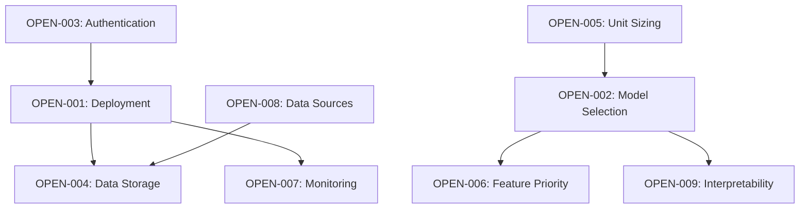

# Open Decisions

This document tracks all **pending decisions** that need to be made for the cfb_model project. Each decision includes context, options, decision owner, and target deadline.

> 📋 **Process**: When a decision is made, move it to `docs/decisions/decision_log.md` with the final choice and rationale.

---

## High Priority Decisions (Target: Sprint 2)

### OPEN-001: Production Deployment Strategy
- **Category**: Infrastructure
- **Owner**: @dev
- **Target Date**: Before Week 4 of CFB season
- **Context**: Currently using local CSV storage with manual weekly pipeline. Need to decide hosting strategy for live operation.
- **Options**:
  1. **Local + Streamlit Cloud**: Keep data local, deploy Streamlit app to cloud with manual data sync
  2. **Full Cloud Migration**: Move entire pipeline to cloud (AWS/GCP) with automated scheduling
  3. **Hybrid**: Local processing, cloud presentation layer
- **Dependencies**: Affects monitoring, backup, and automation decisions
- **Impact**: Critical for operational reliability during betting season

### OPEN-002: Model Selection Post-MVP
- **Category**: Modeling
- **Owner**: @dev
- **Target Date**: After 4 weeks of Ridge baseline results
- **Context**: Ridge regression baseline established. Need criteria for evaluating alternative models.
- **Options**:
  1. **Ensemble Approach**: Combine Ridge + XGBoost + Random Forest
  2. **Single Advanced Model**: Choose best performer (XGBoost, LightGBM, Neural Network)
  3. **Stick with Ridge**: If performance meets targets, keep simple
- **Dependencies**: Requires baseline performance data and evaluation criteria
- **Impact**: Affects model complexity, interpretability, and maintenance overhead

### OPEN-003: Authentication & Access Control
- **Category**: Security/UX  
- **Owner**: @dev
- **Target Date**: Before live deployment
- **Context**: MVP uses single shared password. Need to decide on user management strategy.
- **Options**:
  1. **Single Password**: Keep simple, shared access
  2. **Multi-User with Individual Logins**: Separate accounts with usage tracking
  3. **Tiered Access**: Basic/Premium tiers with different feature access
- **Dependencies**: Affects UI complexity and hosting requirements
- **Impact**: Influences user experience and potential monetization

---

## Medium Priority Decisions (Target: Sprint 3-4)

### OPEN-004: Data Storage Scaling Strategy
- **Category**: Infrastructure
- **Owner**: @dev
- **Target Date**: When dataset exceeds 10GB or performance degrades
- **Context**: Local CSV works for MVP but may need scaling for historical backtesting and feature expansion.
- **Options**:
  1. **Parquet Migration**: Convert to Parquet for better performance, keep local
  2. **Database Integration**: PostgreSQL or DuckDB for complex queries
  3. **Data Lake**: Cloud storage (S3) with query engine (Athena/BigQuery)
- **Dependencies**: Related to production deployment decision
- **Impact**: Query performance, development complexity, hosting costs

### OPEN-005: Betting Unit Sizing Methodology  
- **Category**: Business Logic
- **Owner**: @dev
- **Target Date**: After initial ROI data available
- **Context**: MVP uses flat 1-unit betting. Need sophisticated bankroll management.
- **Options**:
  1. **Kelly Criterion**: Mathematically optimal but aggressive
  2. **Fractional Kelly**: Conservative Kelly (e.g., 25% Kelly)
  3. **Confidence-Based**: Units based on model confidence/edge size
  4. **Fixed Fractional**: Simple % of bankroll per bet
- **Dependencies**: Requires model calibration and confidence intervals
- **Impact**: Risk management and long-term profitability

### OPEN-006: Feature Engineering Expansion Priority
- **Category**: Modeling
- **Owner**: @dev  
- **Target Date**: After MVP feature evaluation
- **Context**: Current feature set is comprehensive but many advanced features are planned.
- **Options**:
  1. **Weather Integration**: Add weather data for outdoor games
  2. **Injury Reports**: Parse and integrate injury data
  3. **Coaching Changes**: Track mid-season coaching impacts
  4. **Line Movement**: Historical line movement patterns
  5. **Advanced Metrics**: EPA models, win probability, leverage index
- **Dependencies**: Data source availability and model performance baseline
- **Impact**: Prediction accuracy vs. complexity trade-offs

---

## Low Priority Decisions (Target: Post-MVP)

### OPEN-007: Performance Monitoring & Alerting
- **Category**: Operations
- **Owner**: @dev
- **Target Date**: After 1 month of live operation
- **Context**: Need automated monitoring for model performance degradation.
- **Options**:
  1. **Simple Email Alerts**: Basic win rate / performance thresholds
  2. **Dashboard + Alerts**: Real-time monitoring with Grafana/similar
  3. **ML-Based Monitoring**: Automated drift detection and model health
- **Dependencies**: Production deployment infrastructure
- **Impact**: Operational reliability and incident response time

### OPEN-008: Data Source Diversification
- **Category**: Data Strategy
- **Owner**: @dev
- **Target Date**: If CFBD becomes unreliable or insufficient
- **Context**: Currently dependent on single data source (CollegeFootballData.com).
- **Options**:
  1. **ESPN API Integration**: Add ESPN as backup/enhancement
  2. **Sports Reference Scraping**: Historical data validation
  3. **Commercial Data**: FanDuel/DraftKings APIs for line data
  4. **Multiple Source Aggregation**: Consensus from multiple APIs
- **Dependencies**: API costs, legal considerations, data quality
- **Impact**: Data reliability and feature richness

### OPEN-009: Model Interpretability & Explainability
- **Category**: UX/Trust
- **Owner**: @dev
- **Target Date**: When model complexity increases beyond Ridge
- **Context**: Need to maintain user trust with "reason codes" as models get more complex.
- **Options**:
  1. **SHAP Integration**: Detailed feature importance explanations
  2. **Custom Reason Codes**: Simple, betting-focused explanations
  3. **Confidence Intervals**: Prediction uncertainty communication
  4. **Comparative Analysis**: Show vs. historical similar games
- **Dependencies**: Model selection and UI design decisions
- **Impact**: User adoption and trust in recommendations

---

## Decision Process

### Making a Decision
1. **Research**: Gather data, pros/cons, expert opinions
2. **Stakeholder Input**: Collect input from relevant parties
3. **Document Options**: Update this document with findings
4. **Set Deadline**: Commit to decision date
5. **Decide & Record**: Move to decision_log.md with rationale

### Decision Criteria Framework
- **MVP Alignment**: Does it support core MVP objectives?
- **Risk vs. Reward**: What's the upside potential vs. downside risk?
- **Complexity Cost**: Implementation and maintenance overhead
- **Reversibility**: How easy is it to change later?
- **Data Availability**: Do we have the data/resources needed?

### Escalation Process
- **Blocked Decision**: If decision is blocking other work, escalate to daily review
- **High Impact**: Major architectural or business decisions require extra validation
- **Resource Constraints**: If decision requires significant time/money, document trade-offs

---

## Decision Dependencies Map

---

## Decision Review Schedule

- **Weekly Review**: Every Wednesday during sprint planning
- **Sprint Planning**: Review all decisions during roadmap updates  
- **Emergency Review**: When decisions are blocking critical work

---

*Last Updated: 2025-01-03*  
*Next Review: Weekly Wednesday sprint planning*
