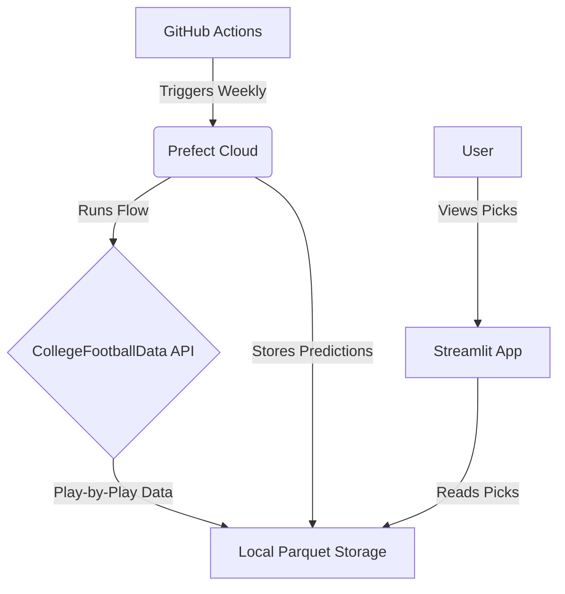

# Project Charter

This document defines the project goals, scope, and technical context for the **cfb_model** project.
It is derived from the [Initial Project Prompt](../planning/initial_prompt.md) and will be updated as the
project evolves.

> 📚 For a high-level entry point and links to all documentation, see [README.md](../README.md).

## Project Overview

**Project Name:** cfb_model

**Project Vision:** To develop a college football betting system that predicts point spreads and
over/unders for FBS games using historical play-by-play data, providing weekly betting
recommendations through a web interface.

**Technical Goal:** Build an automated data pipeline and regression model to generate and display
weekly betting picks with a win rate consistently exceeding the 52.4% break-even threshold.

**Repository:** <https://github.com/connorkitchings/cfb_model.git>

## Users & User Stories

### Primary Persona

**Target User:** A data-savvy sports bettor who wants to move beyond simple heuristics and use
quantitative analysis to find an edge against sportsbook lines.

- **Role:** Analytical Sports Bettor
- **Pain Points:** Manual data collection is time-consuming; it's difficult to systematically
identify value across dozens of games; most public analysis lacks statistical rigor.
- **Goals:** Access automated, data-driven betting recommendations; understand the key factors
  driving each prediction; save time and improve betting ROI.

### Core User Stories

**Story 1:** As an analytical sports bettor, I want to view weekly, model-driven spread predictions
for all FBS games so that I can quickly identify bets where the model's prediction has a significant
edge over the consensus line.

- Priority: Must-have

**Story 2:** As an analytical sports bettor, I want to see the top 3 statistical reasons (SHAP
features) for each recommendation so that I can understand the model's logic and bet with greater
confidence.

- Priority: Must-have

## Features & Scope

**Core Features:** An automated data pipeline to ingest raw play-by-play data from the
CollegeFootballData.com API for the 2014-2024 seasons (excluding 2020). The system will then use
that raw data to engineer features, train a linear regression model for spread prediction, and
perform weekly model retraining. A password-protected Streamlit web interface will display the picks.

### Must-Have (MVP)

**Feature A:** Automated Data Pipeline & Database

- User Story: Story 1
- User Impact: High

**Feature B:** Weekly Prediction Web Interface

- User Story: Story 1, Story 2
- User Impact: High

### Should-Have (Post-MVP)

**Feature C:** Over/Under (Totals) Betting Model

- User Story: (To be defined)

### Out of Scope

- **Feature Scope (MVP):** Includes opponent-adjusted features per [LOG:2025-08-12]; see
  `docs/project_org/feature_catalog.md` and `docs/decisions/decision_log.md`.
- Advanced ML models (e.g., XGBoost, RandomForest) are deferred post-MVP.
- Real-time line movement analysis.
- Integration of non-play-by-play data (e.g., weather, injuries).

## Architecture

### High-Level Summary

The system is an automated weekly pipeline orchestrated by GitHub Actions and Prefect. On a
weekly schedule, a flow ingests play-by-play data from the CollegeFootballData.com API, processes
it, and writes a partitioned local Parquet dataset (via `pyarrow`) using a storage backend
abstraction. A linear regression model is then retrained on the latest data. Predictions for the
upcoming week are generated and saved alongside the dataset. A Streamlit web application provides a
password-protected interface to display these recommendations.

### System Diagram

### Folder Structure

- `/src/cfb_model`: Contains the main source code for the project
- `/docs`: Contains all project documentation, including planning, guides, and logs
- `/notebooks`: Contains Jupyter notebooks for experimentation and analysis
- `/data`: Contains raw, interim, and processed data (not versioned by Git)
- `/tests`: Contains all unit, integration, and functional tests

## Technology Stack

| Category | Technology | Version | Notes |
|----------|------------|---------|-------|
| Package Management | uv | latest | High-performance Python package manager and resolver |
| Core Language | Python | 3.12+ | Primary programming language |
| Linting & Formatting | Ruff | latest | Combines linting, formatting, and import sorting |
| Web Interface | Streamlit | latest | For building and deploying the user-facing application |
| Storage | Local Parquet (pyarrow) | latest | Partitioned dataset with per-partition manifests |
| Testing | Pytest | latest | Framework for writing and running tests |
| Documentation | MkDocs | latest | Static site generator for project documentation |
| Orchestration | Prefect | latest | Workflow orchestration and scheduling |

## Risks & Assumptions

### Key Assumptions

**Data Availability:** We assume the CollegeFootballData.com API will remain available, reliable,
and up-and consistent throughout the season.

**Model Viability:** We assume that opponent-adjusted features derived from play-by-play data
contain enough signal to build a predictive model with a win rate >52.4%.

### Technical Risks

| Risk | Probability | Impact | Mitigation |
|------|-------------|--------|------------|
| CFB Data API Failure | Low | High | Implement robust error handling, data validation, and logging.
If the API is down, the pipeline should fail gracefully and notify administrators. |

## Decision Log

*Key architectural and product decisions will be recorded here as the project evolves.*

---

*This document consolidates the project definition, technical context, and scope appendix into a
single source of truth.*
